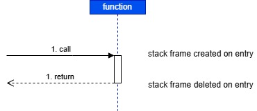
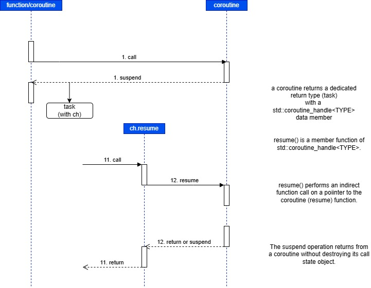
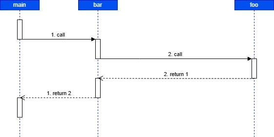
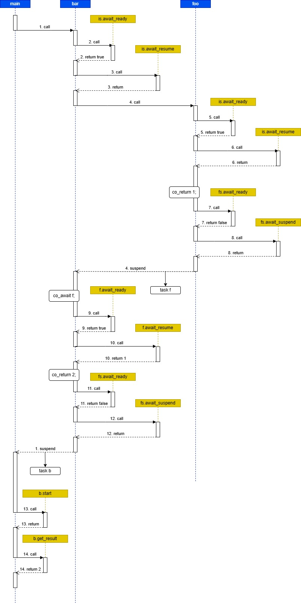
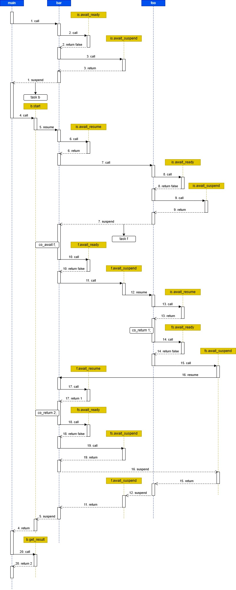
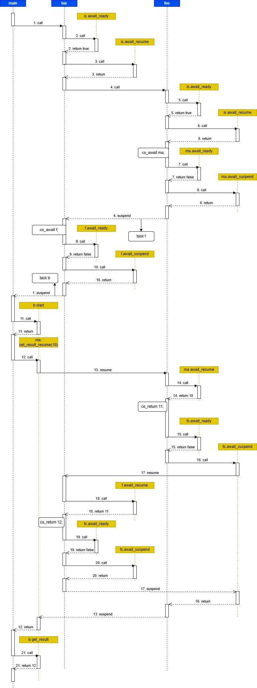
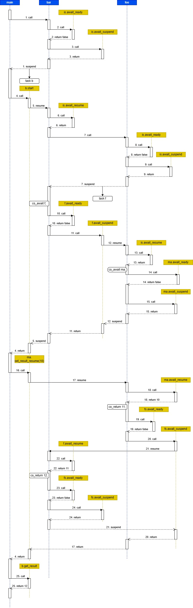
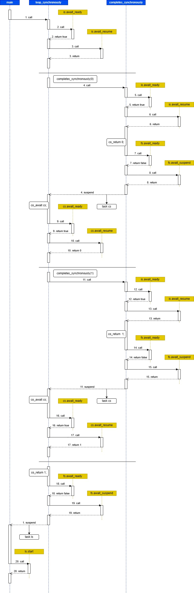
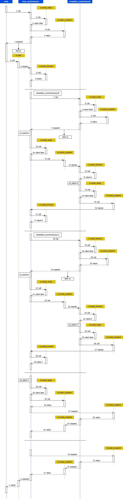

# Study: Control flow

## Overview

The following table gives an overview of the eight examples used in this study.

| Program            | Description                                                       |
| ------------------ | ----------------------------------------------------------------- |
| p1100e_void.cpp    | Eager start, synchronous completion coroutine called 4 times.     |
| p1100l_void.cpp    | Lazy start, synchronous completion coroutine called 4 times.      |
| p1100ae_void.cpp   | Eager start, synchronous completion coroutine called 10000 times. |
| p1100al_void.cpp   | Lazy start, synchronous completion coroutine called 10000 times.  |
|                    | Crashes!                                                          |
| p2010e_void-sc.cpp | Eager start, synchronous completion coroutine called once.        |
| p2010l_void-sc.cpp | Lazy start, synchronous completion coroutine called once.         |
| p2020e_void-ma.cpp | Eager start, asynchronous completion coroutine called once.       |
| p2020l_void-ma.cpp | Lazy start, asynchronous completion coroutine called once.        |

The 'void' in the name of the programs refers to using a final_awaiter type
with the await_suspend() function using void as return type.
This explains the crash of p1100al_void.cpp.
See [initial_suspend](../initial_suspend) for an analysis and solution to this problem.

The following is the output of the eight examples:

```
C:\...\corolib\out\build\x64-Debug\studies\control-flow>.\cf-p1100e_void.exe
00: 1: main(): task ls = loop_synchronously(4);
00: loop_synchronously(4)
00: 4: loop_synchronously(4): task cs = completes_synchronously(0)
00: completes_synchronously(0): co_return 0;
00: loop_synchronously(4): v += co_await cs;
00: 11: loop_synchronously(4): task cs = completes_synchronously(1)
00: completes_synchronously(1): co_return 1;
00: loop_synchronously(4): v += co_await cs;
00: 18: loop_synchronously(4): task cs = completes_synchronously(2)
00: completes_synchronously(2): co_return 2;
00: loop_synchronously(4): v += co_await cs;
00: 25: loop_synchronously(4): task cs = completes_synchronously(3)
00: completes_synchronously(3): co_return 3;
00: loop_synchronously(4): v += co_await cs;
00: loop_synchronously(4): co_return 6;
00: main(): ls.start();
00: main(): int v = ls.get_result();
00: v = 6
00: --------------------------------------------------------
00: nr_resumptions = 0
00:     cons    dest    diff    max
00: cor 5       5       0       2
00: pro 5       5       0       2
00: ini 5       5       0       1
00: awa 4       4       0       1
00: fin 5       5       0       1
00: --------------------------------------------------------
00: Waiting 1000 milliseconds before exiting

C:\...\corolib\out\build\x64-Debug\studies\control-flow>.\cf-p1100l_void.exe
00: 1: main(): task ls = loop_synchronously(4);
00: main(): ls.start();
00: loop_synchronously(4)
00: 7: loop_synchronously(4): task cs = completes_synchronously(0)
00: loop_synchronously(4): v += co_await cs;
00: completes_synchronously(0): co_return 0;
00: 18: loop_synchronously(4): task cs = completes_synchronously(1)
00: loop_synchronously(4): v += co_await cs;
00: completes_synchronously(1): co_return 1;
00: 29: loop_synchronously(4): task cs = completes_synchronously(2)
00: loop_synchronously(4): v += co_await cs;
00: completes_synchronously(2): co_return 2;
00: 40: loop_synchronously(4): task cs = completes_synchronously(3)
00: loop_synchronously(4): v += co_await cs;
00: completes_synchronously(3): co_return 3;
00: loop_synchronously(4): co_return 6;
00: main(): int v = ls.get_result();
00: v = 6
00: --------------------------------------------------------
00: nr_resumptions = 9
00:     cons    dest    diff    max
00: cor 5       5       0       2
00: pro 5       5       0       2
00: ini 5       5       0       1
00: awa 4       4       0       1
00: fin 5       5       0       1
00: --------------------------------------------------------
00: Waiting 1000 milliseconds before exiting

C:\...\corolib\out\build\x64-Debug\studies\control-flow>.\cf-p1100ae_void.exe
00: main(): task ls = loop_synchronously(10000);
00: main(): ls.start();
00: main(): int v = ls.get_result();
00: v = 49995000
00: --------------------------------------------------------
00: nr_resumptions = 0
00:     cons    dest    diff    max
00: cor 10001   10001   0       2
00: pro 10001   10001   0       2
00: ini 10001   10001   0       1
00: awa 10000   10000   0       1
00: fin 10001   10001   0       1
00: --------------------------------------------------------
00: Waiting 1000 milliseconds before exiting

C:\...\corolib\out\build\x64-Debug\studies\control-flow>.\cf-p1100al_void.exe
00: main(): task ls = loop_synchronously(10000);
00: main(): ls.start();

C:\...\corolib\out\build\x64-Debug\studies\control-flow>.\cf-p2010e_void-sc.exe
00: 1: main(): task b = bar();
00: 4: bar(): task f = foo();
00: foo(): co_return 1;
00: bar(): int v = co_await f;
00: bar(): co_return 2;
00: main(): b.start();
00: main(): int v = b.get_result();
00: main(): v = 2;
00: main(): return 0;
00: --------------------------------------------------------
00: nr_resumptions = 0
00:     cons    dest    diff    max
00: cor 2       2       0       2
00: pro 2       2       0       2
00: ini 2       2       0       1
00: awa 1       1       0       1
00: fin 2       2       0       1
00: --------------------------------------------------------
00: Waiting 1000 milliseconds before exiting

C:\...\corolib\out\build\x64-Debug\studies\control-flow>.\cf-p2010l_void-sc.exe
00: 1: main(): task b = bar();
00: main(): b.start();
00: 7: bar(): task f = foo();
00: bar(): int v = co_await f;
00: foo(): co_return 1;
00: bar(): co_return 2;
00: main(): int v = b.get_result();
00: main(): v = 2;
00: main(): return 0;
00: --------------------------------------------------------
00: nr_resumptions = 3
00:     cons    dest    diff    max
00: cor 2       2       0       2
00: pro 2       2       0       2
00: ini 2       2       0       1
00: awa 1       1       0       1
00: fin 2       2       0       1
00: --------------------------------------------------------
00: Waiting 1000 milliseconds before exiting

C:\...\corolib\out\build\x64-Debug\studies\control-flow>.\cf-p2020e_void-ma.exe
00: 1: main(): task b = bar();
00: 4: bar(): task f = foo();
00: foo(): int v = co_await ma;
00: bar(): int v = co_await f;
00: main(): b.start();
00: main(): ma.set_result_and_resume(10);
00: foo(): co_return 11;
00: bar(): co_return 12;
00: main(): int v = b.get_result();
00: main(): v = 12;
00: main(): return 0;
00: --------------------------------------------------------
00: nr_resumptions = 2
00:     cons    dest    diff    max
00: cor 2       2       0       2
00: pro 2       2       0       2
00: ini 2       2       0       1
00: awa 1       1       0       1
00: fin 2       2       0       1
00: --------------------------------------------------------
00: Waiting 1000 milliseconds before exiting

C:\...\corolib\out\build\x64-Debug\studies\control-flow>.\cf-p2020l_void-ma.exe
00: 1: main(): task b = bar();
00: main(): b.start();
00: 7: bar(): task f = foo();
00: bar(): int v = co_await f;
00: foo(): int v = co_await ma;
00: main(): ma.set_result_and_resume(10);
00: foo(): co_return 11;
00: bar(): co_return 12;
00: main(): int v = b.get_result();
00: main(): v = 12;
00: main(): return 0;
00: --------------------------------------------------------
00: nr_resumptions = 4
00:     cons    dest    diff    max
00: cor 2       2       0       2
00: pro 2       2       0       2
00: ini 2       2       0       1
00: awa 1       1       0       1
00: fin 2       2       0       1
00: --------------------------------------------------------
00: Waiting 1000 milliseconds before exiting
PS C:\...\corolib\out\build\x64-Debug\studies\control-flow>
```

Consider the following code extract from p1100e_void.cpp and p1100l_void.cpp.
The numbers indicate the order in which statements are executed.
Although the code is exactly the same, the order in which the statements are executed is different in both programs.
This is because these programs include another definition of a task type.

```c++
task completes_synchronously(int i) {
    print(PRI1, "completes_synchronously(%d): co_return %d;\n", i, i);      // 2 (eager start) or 3 (lazy start)
    co_return i;                                                            // 2 (eager start) or 3 (lazy start)
}

task loop_synchronously(int count) {
    print(PRI1, "loop_synchronously(%d)\n", count);
    int v = 0;
    for (int i = 0; i < count; ++i) {
        counter++;
        print(PRI1, "%d: loop_synchronously(%d): task cs = completes_synchronously(%d)\n", counter, count, i);      // 1
        task cs = completes_synchronously(i);                                                                       // 1
        print(PRI1, "loop_synchronously(%d): v += co_await cs;\n", count);      // 3 (eager start) or 2 (lazy start)
        v += co_await cs;                                                       // 3 (eager start) or 2 (lazy start)
    }
    print(PRI1, "loop_synchronously(%d): co_return %d;\n", count, v);
    co_return v;
}
```

Consider the following code extract from p2010e_void-sc.cpp and p2010l_void-sc.cpp.
The numbers indicate the order in which statements are executed.
Although the code is exactly the same, the order in which the statements are executed is different in both programs.
This is because these programs include another definition of a task type.

```c++
task foo() {
    print(PRI1, "foo(): co_return 1;\n");       // 2 (eager start) or 3 (lazy start)
    co_return 1;                                // 2 (eager start) or 3 (lazy start)
}

task bar() {
    counter++;
    print(PRI1, "%d: bar(): task f = foo();\n", counter);       // 1
    task f = foo();                                             // 1
    print(PRI1, "bar(): int v = co_await f;\n");                // 3 (eager start) or 2 (lazy start)
    int v = co_await f;                                         // 3 (eager start) or 2 (lazy start)
    print(PRI1, "bar(): co_return %d;\n", v+1);
    co_return v+1;
}
```

In contrast to C# that uses eager start (see [control-flow-cs](../control-flow-cs)) and
Python that uses lazy start (see [control-flow-python](../control-flow-python)),
in C++ we can program the behavior ourselves.

The rest of this document illustrates the control flow using a variant of UML sequence diagrams.

## Introduction

The reader is referred to [awaiter type variants](../../docs/awaiter_type_variants.md) for an introduction to awaiter types.

In this document we study the control flow in some simple functions and coroutines.
The examples originate from [initial_suspend](../initial_suspend) and use the same name as in mentioned directory.

These examples serve as an introduction to a more detailed study of the behavior at the initial and final suspend points
in [initial_suspend](../initial_suspend) and [final_suspend](../final_suspend), respectively.

Functions support two operations: call and return.
This is illustrated in the following scenario.



Coroutines support four operations: call and return, and suspend and resume.
Therefore, coroutines can be considered to be a generalization of functions.
This is illustrated in the following scenario.



Both diagrams are based upon UML sequence diagrams, with 2 differences.
* The vertical timelines correspond to functions/coroutines instead of objects.
* The horizontal arrows correspond to the two/four operations on functions/coroutines instead of to member function calls on objects.

In more detail:
* Call and resume operations are depicted with full lines, return and suspend operations with dashed lines.
* A call/resume operation with number N must be followed with a return/suspend operation in the other direction with the same number.
* In case of functions:
    * a call operation is always paired with a return operation with the same number.
* In case of coroutines:
    * a call operation can be paired with a return operation with the same number.
    * a call operation can also be paired with a suspend operation with the same number.
    * a suspend operation requires a resume operation to continue the flow in the coroutine.
* Coroutines may not use the return or resume operation, but suspend at their final suspend point.
  In other words, the last operation on a coroutine can be suspend.
  In that case a 5th operation, destroy, must be used to release the coroutine state.

Note: the destroy operation will not be illustrated in the diagrams.

For a explanation of eager and lazy start, the reader is referred to [initial_suspend_](../initial_suspend]).

We consider two forms of completion:
* Synchronous completion: the leaf coroutine doesn't contain a co_await statement, only a co_return statement.
* Asynchronous completion: the leaf coroutine contains a co_await statement at which it will suspend and must be resumed later.

Synchronous completion is also possible if the leaf coroutine co_await's an awaitable that completes synchronously,
such as std::suspend_never. However, this does not change much to the basic explanation.

In case of asynchronous completion, we assume that this resumption takes place from main() and is
performed on the same thread as the original coroutine call.
In other words, the application uses only one thread.

This document analyzes the behavior of 4 coroutine examples:
* Synchronous completion with eager and with lazy start.
* Asynchronous completion with eager abd with lazy start.

A complete control flow encompasses both the initial and the final suspend point.

At the final suspend point, a user-defined type (final_awaiter) is used, with the following signature of await_suspend:

    void await_suspend(coroutine_handle<promise_type> h) noexcept

The reader is referred to [final_suspend_](../final_suspend]) for a more in-depth study of final awaiter types,
more in particular concerning the avoidance of memory leaks.

## Functions

The following scenario shows the control flow in an application that only uses functions.



There is no source code, because it is trivial to reconstruct the source code from the scenario.

## Coroutines: synchronous completion

Consider the following example 
(see [p2010e_void-sc.cpp](./p2010e_void-sc.cpp) 
 and [p2010l_void-sc.cpp](./p2010l_void-sc.cpp) for the full source code):

```c++
task foo() {
    co_return 1;
}

task bar() {
    task f = foo();
    int v = co_await f;
    co_return v+1;
}

int main() {
    task b = bar();
    b.start();
    int v = b.get_result();
    print(PRI1, "main(): v = %d;\n", v);
    return 0;
}
```

The example uses synchronous completion:
function foo() doesn't contain a co_await statement, only a co_return statement.

After a few transform steps the (simplified) (pseudo-)code may look like:

```c++
task foo()
{
    // create coroutine state with embedded pr (task::promise_type) object
    // initial suspend point code section
    // co_await initial_suspend();
    auto is = pr->initial_suspend();
    // Lazy start coroutines:  is.await_ready() returns false
    // Eager start coroutines: is.await_ready() returns true
    if (!is.await_ready()) {
        save_resume_point(resume_point_0);
        is.await_suspend(...);
        return_to_caller_or_resumer();          // return_point_0
    }
resume_point_0:
    is.await_resume(...);
        
    try {
        // user-authored code section
        // co_return 1;
        return_value(1);
    }
    catch(...) {
        report_unhandled_exception();
    }

    // final suspend point code section
final_suspend_point:
    // co_await final_suspend();
    auto fs = pr->final_suspend();
    // returns false  (unless final_suspend() returns std::suspend_never)
    if (!fs.await_ready()) {
        mark_coroutine_as_done();
        fs.await_suspend(...);
        return_to_caller_or_resumer();          // return_point_1
    }
    fs.await_resume();                          // This code may never be reached
    return_to_caller_or_resumer();              // return_point_2
} // foo

task bar()
{
    // create coroutine state with embedded pr (task::promise_type) object
    // initial suspend point code section
    // co_await initial_suspend();
    auto is = pr->initial_suspend();
    // Lazy start coroutines: is.await_ready() returns false
    // Eager start coroutines: is.await_ready() returns true
    if (!is.await_ready()) {
        save_resume_point(resume_point_0);
        is.await_suspend(...);
        return_to_caller_or_resumer();          // return_point_0
    }
resume_point_0:
    is.await_resume(...);

    try {
        // user-authored code section
        task f = foo();
        // int v = co_await f;
        if (!f.await_ready()) {
            // coroutine is considered to be suspended at this point
            save_resume_point(resume_point_1);
            f.await_suspend(...);
            return_to_caller_or_resumer();       // return_point_1
        }
resume_point_1:
        // coroutine is considered to be resumed here
        int v = f.await_resume();

        // co_return v+1;
        return_value(v+1);
    }
    catch(...) {
        report_unhandled_exception();
    }

    // final suspend point code section
final_suspend_point:
    // co_await final_suspend();
    auto fs = pr->final_suspend();
    // returns false (unless final_suspend() returns std::suspend_never)
    if (!fs.await_ready()) {
        mark_coroutine_as_done();
        fs.await_suspend(...);
        return_to_caller_or_resumer();          // return_point_2
    }
    fs.await_resume();                          // This code may never be reached
    return_to_caller_or_resumer();              // return_point_3
} // bar

int main() {
    task b = bar();
    b.start();
    return 0;
}
```

This code can be useful to follow the control flow sequences below, comparing eager and lazy start.

Note: In the (pseudo-)code above, return_to_caller_or_resumer() can be considered to be a kind of macro, 
that returns either a task object if the coroutine is called for the first time,
or a pointer to a coroutine state object if the coroutine is resumed from another coroutine or function.
A further transformation step will split foo() and bar() into two functions,
being a ramp function returning a task object and a resume function returning a pointer to a coroutine state object.
"return_to_caller_or_resumer();" can then be replaced with "return task;" or "return p_coroutine_state;" respectively.

For a more correct translation to pre C++20 code, the reader is referred to [transform](../transform).

### Eager start

Source code: [p2010e_void-sc.cpp](./p2010e_void-sc.cpp)

Scenario:



The control flow sequence is as follows:

* main() calls bar() (1).
* bar() enters its initial suspend code section: bar() calls co_await initial_suspend();
    * pr->initial_suspend() returns std::suspend_never.
    * bar() evaluates is.await_ready(), which returns true (2).
    * bar() calls is.await_resume() (3).
* bar() enters its user-authored code.
* bar() calls foo() (4).
* foo() enters its initial suspend code section: foo() calls co_await initial_suspend();
    * pr->initial_suspend() returns std::suspend_never.
    * foo() evaluates is.await_ready(), which returns true (5).
    * foo() calls is.await_resume() (6).
* foo() enters its user-authored code.
* foo() executes co_return.
* foo() enters its final suspend code section: foo() calls co_await final_suspend();
    * pr->final_suspend() returns final_awaiter.
    * foo() evaluates fs.await_ready(), which returns false (7).
    * foo() calls fs.await_suspend(). There is no coroutine to resume, so this function returns immediately (8)
* foo() returns control to bar() at return_point_1.
* bar() saves the result value of foo() in task f.
* bar() co_awaits task f:
    * bar() evaluates f.await_ready(), which returns true because foo() ran to completion (9).
    * bar() calls f.await_resume() (10).
* bar() executes co_return.
* bar() enters its final suspend code section: bar() calls co_await final_suspend();
    * pr->final_suspend() returns final_awaiter.
    * bar() evaluates fs.await_ready(), which returns false (11).
    * bar() calls fs.await_suspend(). There is no coroutine to resume, so this function returns immediately (12).
* bar() returns control to main() at return_point_1.
* main() saves the return_value of bar() in b;
* main() calls b.start() (13). This function has an empty implementation in case of an eager task.
* main() calls b.get_result() (14). 
* main() returns.

Conclusion: The code does not suspend and consequently it does not have to be resumed.
The control flow is the same as if all coroutines were "ordinary" functions.

### Lazy start

Source code: [p2010l_void-sc.cpp](./p2010l_void-sc.cpp)

Scenario:



The control flow sequence is as follows:

+ main() calls bar() (1).
* bar() enters its initial suspend code section: bar() calls co_await initial_suspend();
    * pr->initial_suspend() returns std::suspend_always.
    * bar() evaluates is.await_ready(), which returns false (2).
    * bar() calls is.await_suspend() (3).
    * bar() returns control to its calling function at return_point_0.
* main() saves the return value of bar() in task b.
* main() calls b.start() (4).      
* start() resumes bar() (5). This is the first resume.
* We re-enter bar() at resume_point_0.
* bar() calls is.await_resume() (6).
* bar() enters its user-authored code section.
* bar() calls foo() (7).
* foo() enters its initial suspend code section: foo() calls co_await initial_suspend();
    * pr->initial_suspend() returns std::suspend_always.
    * foo() evaluates is.await_ready(), which returns false (8).
    * foo() calls is.await_suspend() (9).
    * foo() returns control to its calling function at return_point_0.
* bar() saves the return value of foo() in task f.
* bar() calls co_await f.
    * bar() evaluates f.await_ready(), which returns false (10).
    * bar() calls f.await_suspend() (11).
    * This implementation saves a coroutine_handle to bar() and it resumes foo() (12). This is the second resume.
* We re-enter foo() at resume_point_0.
* foo() calls is.await_resume() (13).
* foo() enters its user-authored code section.
* foo() executes co_return.
* foo() enters its final suspend code section: foo() calls co_await final_suspend();
    * pr->final_suspend() returns final_awaiter.
    * foo() evaluates fs.await_ready(), which returns false (14).
    * foo() calls fs.await_suspend() (15).
    * The coroutine_handle to bar() is saved. foo() resumes bar() (16). This is the third resume.
* We re-enter bar() at resume_point_1.
* bar() calls f.await_resume() (17).
    * Notice that f.await_resume() is indirectly called from f.await_suspend(), which is indirectly called from b.start().
* bar() executes co_return;
* bar() enters its final suspend code section: bar() calls co_await final_suspend();
    * pr->final_suspend() returns final_awaiter.
    * bar() evaluates fs.await_ready(), which returns false (18).
    * bar() calls fs.await_suspend(). There is no coroutine to resume, so this function returns immediately (19).
* bar() returns control to its caller (resumer), which is fs.await_suspend() in foo() (16).
* In foo(), the call to fs.await_suspend() returns (15).
* foo() returns control to its caller, which is f.await_suspend() in bar() (12).
* In bar(), the call to f.await_suspend() returns (11).
* bar() returns control to its caller, which is b.start() (5).
* In main(), the call to b.start() returns (4).
* main() calls b.get_result() (20).
* main() returns.

Conclusion: The code suspends and consequently it has to be resumed 3 times.
This is a very complex control flow for something that is essentially a function call scenario
(main() calls a function bar() which calls a function foo()).

## Coroutines: asynchronous completion on the same thread

Consider the following example 
(see [p2020e_void-ma.cpp](./p2020e_void-ma.cpp) 
 and [p2020l_void-ma.cpp](./p2020l_void-ma.cpp) for the full source code):

```c++
mini_awaiter ma;

task foo() {
    int v = co_await ma;
    co_return v+1;
}

task bar() {
    task f = foo();
    int v = co_await f;
    co_return v+1;
}

int main() {
    task b = bar();
    b.start();
    ma.set_result_and_resume(10);
    int v = b.get_result();
    // Use v
    return 0;
}
```

### Eager start

Source code: [p2020e_void-ma.cpp](./p2012e_void-ma.cpp)

Scenario:



### Lazy start

Source code: [p2020l_void-ma.cpp](./p2012l_void-ma.cpp)

Scenario:



## Coroutines: synchronous completion in the presence of a loop

Consider the following example 
(see [p1100e_void.cpp](./p1100e_void.cpp) 
 and [p1100l_void.cpp](./p1100l_void.cpp) for the full source code):

```c++
task completes_synchronously(int i) {
    co_return i;
}

task loop_synchronously(int count) {
    int res = 0;
    for (int i = 0; i < count; ++i) {
        task cs = completes_synchronously(i);
        res += co_await cs;
    }
    co_return res;
}

int main() {
    task ls = loop_synchronously(2);
    ls.start();
    int res = ls.get_result();
    return 0;
}
```

### Eager start

Source code: [p1100e_void.cpp](./p1100e_void.cpp)

Scenario:



### Lazy start

Source code: [p1100l_void.cpp](./p1100l_void.cpp)

Scenario:


