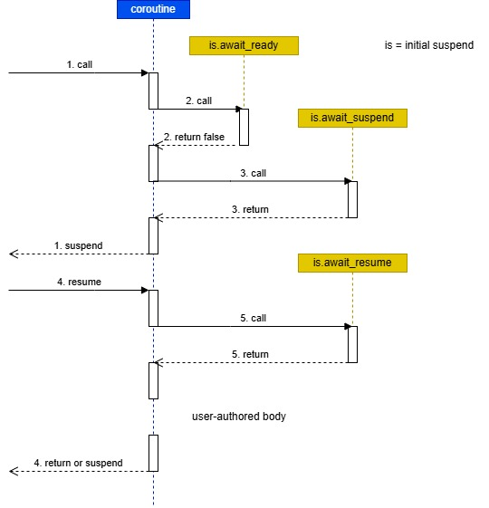
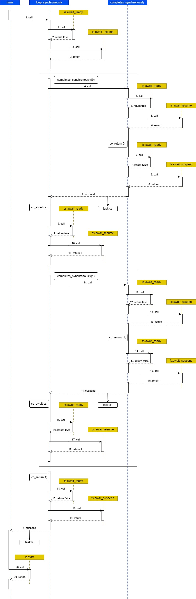
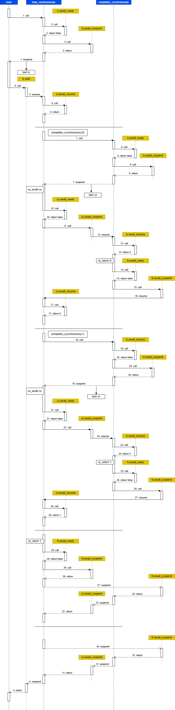

# Study initial_suspend(): lazy or eager start?

## Introduction

The reader is referred to [awaiter type variants](../../docs/awaiter_type_variants.md) for an introduction to awaiter types.

The examples in this folder are heavily inspired by the article
https://lewissbaker.github.io/2020/05/11/understanding_symmetric_transfer 
and the corresponding code in https://godbolt.org/z/-Kw6Nf, https://godbolt.org/z/gy5Q8q, https://godbolt.org/z/7fm8Za 
and https://godbolt.org/z/9baieF

The main purpose of this study is to compare the advantages and disadvantages of
lazy start and eager start coroutines for the three variants of await_suspend()
(having void, bool or std::coroutine_handle<> as return type)
and the impact this choice has on the behavior of the application.

This document has the following sections:

* Lazy versus eager start: definitions
* Task types
* Introductory examples
* Synchronous completion from a loop
* Asynchronous completion on another thread
* Lazy start changes the semantics of co_await
* Lazy start introduces performance loss (compared with eager start)
* Starting a coroutine from a normal function (including main())
* task object of foo() goes out of scope
* Exception in the pre co_await code

## Lazy versus eager start: definitions

Consider two standardized awaiter types, std::suspend_always and std::suspend_never.

```c++
namespace std
{
    struct suspend_always {
        constexpr suspend_always() noexcept = default;
        constexpr bool await_ready() const noexcept { return false; }
        constexpr void await_suspend(coroutine_handle<>) const noexcept {}
        constexpr void await_resume() const noexcept {}
    };

    struct suspend_never {
        constexpr suspend_never() noexcept = default;
        constexpr bool await_ready() const noexcept { return true; }
        constexpr void await_suspend(coroutine_handle<>) const noexcept {}
        constexpr void await_resume() const noexcept {}
    };
}
```

In a coroutine with return type 'task' and *lazy* start, task::promise_type::initial_suspend() returns std::suspend_always
(or an equivalent type).



illustrates the control flow at the initial suspend point.

std::suspend_always::await_ready() unconditionally returns false, so the next function that is called is 
std::suspend_always::await_suspend().
Next, the coroutine suspends and returning control to its caller.
Some time later, the caller will resume the coroutine, calling std::suspend_always::await_suspend().
Then the coroutine starts executing the code in its body.

In a coroutine with return type 'task' and *eager* start, task::promise_type::initial_suspend() returns std::suspend_never
(or an equivalent type).


illustrates the control flow at the initial suspend point.

std::suspend_never::await_ready() unconditionally returns true, so the next function that is called is 
unconditionally returns true, so the next function that is called is std::suspend_never::await_resume().
Then the coroutine starts executing the code in its body.

In an eager start coroutine, function await_suspend() is not called at the initial suspend point
and the coroutine immediately enters its user-authored body.

## Task types

Let's turn to the type returned by a coroutine, which we will just call task.
struct task defines an awaiter type, called task::awaiter.

The function task::awaiter::await_suspend() can have one of the following three return types:
void, bool, or coroutine_handle<>.

### Lazy start

The following provides an abstraction of the code that can be found in the files
task_void.h, task_bool.h and task_coroutine_handle.h.

```c++
    task::promise_type::initial_suspend() returns std::suspend_always

    task::awaiter
        await_ready() returns bool
	       return false;
        await_suspend(std::coroutine_handle<promise_type> h) returns either
	       void                     // see task_void.h
	       bool                     // see task_bool.h
	       std::coroutine_handle<>  // see task_coroutine_handle.h
       await_resume() returns void

    task::promise_type::final_awaiter
        await_ready() returns bool
	        return false;
        await_suspend(std::coroutine_handle<promise_type> h) returns either
	        void                    // see task_void.h and task_bool.h
	        bool                    // not used
	        std::coroutine_handle<> // see task_coroutine_handle.h
        await_resume() returns void

    task::promise_type::final_suspend() returns std::final_awaiter
```

Function task::awaiter::await_ready() always returns false.

For all three return types of task::awaiter::await_suspend(), this function has to resume 
the coroutine referenced by a coroutine_handle called coro_.
In case of void and bool return types, this is accomplished by the statement coro_.resume(); in the function implementation.
In case of a std::coroutine_handle<> return type, await_suspend() has to return coro_.
The generated C++ code will then call coro_.resume().

Notice that any variant of task::awaiter::await_suspend() can be combined with any variant of
task::promise_type::final_awaiter::await_suspend(), leading to nine possible combinations.

### Eager start

The following provides an abstraction of the code that can be found in the files
taske_void.h, taske_bool.h and taske_coroutine_handle.h.

```c++
    task::promise_type::initial_suspend() returns std::suspend_never

    task::awaiter
        await_ready() returns bool
	        return coro_.done(); (or return ready; if available)
        await_suspend(std::coroutine_handle<promise_type> h) returns either
	        void                        // see taske_void.h
	        bool                        // see taske_bool.h
	        std::coroutine_handle<>     // see taske_coroutine_handle.h
        await_resume() returns void

    task::promise_type::final_awaiter
        await_ready() returns bool
	        return false;
        await_suspend(std::coroutine_handle<promise_type> h) returns either
	       void                         // see taske_void.h and taske_bool.h
	       bool                         // not used
	       std::coroutine_handle<>      // see taske_coroutine_handle.h
        await_resume() returns void

    task::promise_type::final_suspend() returns std::final_awaiter
```

Function task::awaiter::await_ready() can now return false or true.

For none of the three return types, task::awaiter::await_suspend() has to resume the coroutine
referenced by coroutine_handle coro_.
In case of a std::coroutine_handle<> return type, await_suspend() has to return std::noop_coroutine().

Notice again that any variant of task::awaiter::await_suspend() can be combined with any variant of
task::promise_type::final_awaiter::await_suspend(), leading to nine possible combinations.

## Introductory examples

The reader is referred to [control-flow](../control-flow) for some introductory examples.
These examples illustrate a complete control flow, including initial and final suspend points.
(Therefore they have been placed in a separate study.)

## Synchronous completion from a loop

The following has been slightly adapted from the core example
in https://lewissbaker.github.io/2020/05/11/understanding_symmetric_transfer.

(See [p1100e_void.cpp](./p1100e_void.cpp) 
 and [p1100l_void.cpp](./p1100l_void.cpp) for the full source code):


```c++
task completes_synchronously() {
    co_return 0;
}

task loop_synchronously(int count) {
    int res = 0;
    for (int i = 0; i < count; ++i) {
        task cs = completes_synchronously();
        res = co_await cs;
    }
    co_return res;
}

int main() {
    task ls = loop_synchronously(100);
    ls.start();
    return 0;
}
```

This code translates roughly into:

```c++
task completes_synchronously()
{
    // co_await initial_suspend();
    auto cs_is = pr->initial_suspend();     // cs_is is short for completes_synchronously_initial_suspend
    if (!cs_is.await_ready()) {
        save_resume_point(cs_resume_point_0);
        cs_is.await_suspend(...);
        return_to_caller_or_resumer();      // cs_return_point_0
    }
cs_resume_point_0:
    cs_is.await_resume(...);
    
    try {
        // co_return;
        return_void();
    }
    catch(...) {
        report_unhandled_exception();
    }

cs_final_suspend_point:
    // co_await final_suspend();
    auto cs_fs = pr->final_suspend();       // cs_fs is short for completes_synchronously_final_suspend
    if (!cs_fs.await_ready()) {
        mark_coroutine_as_done();
        cs_fs.await_suspend(...);
        return_to_caller_or_resumer();      // cs_return_point_1
    }
    cs_fs.await_resume();
    return_to_caller_or_resumer();          // cs_return_point_2
} // completes_synchronously

    
task loop_synchronously()
{
    // co_await initial_suspend();
    auto ls_is = pr->initial_suspend();     // ls_is is short for loop_synchronously_initial_suspend
    if (!ls_is.await_ready()) {
        save_resume_point(ls_resume_point_0);
        ls_is.await_suspend(...);
        return_to_caller_or_resumer();      // ls_return_point_0
    }
ls_resume_point_0:
    ls_is.await_resume(...);

    try {
        for (int i = 0; i < count; ++i)
            task ls_cs = completes_synchronously();  // ls_cs is short for loop_synchronously_complete_synchronously
            if (!ls_cs.await_ready()) {
                save_resume_point(ls_resume_point_1);
                ls_cs.await_suspend(...);
                return_to_caller_or_resumer();       // ls_return_point_1
            }
ls_resume_point_1:
            ls_cs.await_resume();
        } // for
        // co_return;
        return_void();
    }
    catch(...) {
        report_unhandled_exception();
    }

final_suspend_point:
    // co_await final_suspend();
    auto ls_fs = pr->final_suspend();            // ls_fs is short for loop_synchronously_final_suspend
    if (!ls_fs.await_ready()) {
        mark_coroutine_as_done();
        ls_fs.await_suspend(...);
        return_to_caller_or_resumer();          // ls_return_point_2
    }
    ls_fs.await_resume();
    return_to_caller_or_resumer();              // ls_return_point_3
} // loop_synchronously

int main() {
    task ls = loop_synchronously();                // ls is short for loop_synchronously
    ls.start();
    return 0;
}
```

Note: In the (pseudo-)code above, return_to_caller_or_resumer() can be considered to be a kind of macro, 
that returns either a task object if the coroutine is called for the first time,
or a pointer to a coroutine state object if the coroutine is resumed from another coroutine or function.
A further transformation step will split completes_synchronously() and loop_synchronously() into two functions,
being a ramp function returning a task object and a resume function returning a pointer to a coroutine state object.
"return_to_caller_or_resumer();" can then be replaced with "return task;" or "return p_coroutine_state;" respectively.

For a more correct translation to pre C++20 code, the reader is referred to [transform](../transform).

### Eager start

Source code: [p1100e_void.cpp](../control-flow/p1100e_void.cpp).

Scenario:



This control flow is not described.

Eager start coroutines follow the same control flow
as normal function calls, because that is what synchronous completion means.
There are additional steps, but these steps do not change the control flow.

Lazy start coroutines, on the other hand, use a very complex and (in my opinion)
non-intuitive control flow as we will see next.

### Lazy start

#### Problem: mutually recursive calls which may cause stack overflow

Lazy start leads to mutually recursive calls when a coroutine is called in a loop.
These mutually recursive calls may lead to stack overflow in case the number of recursive calls is large enough.

The reason for this mutual recursion is the use of a lazy start coroutine type and not the fact that 
task::promise_type::final_awaiter::await_suspend(coroutine_handle<promise_type>) and
task::awaiter::await_suspend(coroutine_handle<>) return void or bool.

Indeed, by using an eager start coroutine type instead (see above),
as is done in [taske_void.h](taske_void.h), both coroutines do not call each other recursively.
Instead, the control flow is the same as that of normal functions: the coroutines do not suspend and resume,
but just use call and return.

Source code: [p1100l_void.cpp](../control-flow/p1100l_void.cpp).

Scenario:



The control flow sequence is as follows:

* main() calls loop_synchronously() (1).
* loop_synchronously() enters its initial suspend code section: loop_synchronously() calls co_await initial_suspend();
    * pr->initial_suspend() returns std::suspend_always.
    * loop_synchronously() evaluates ls_is.await_ready() (2), which returns false.
    * loop_synchronously() calls ls_is.await_suspend() (3) (which does nothing).
    * loop_synchronously() returns control to its calling function at ls_return_point_0.
* main() saves the return value of loop_synchronously() in task ls.
* main() calls ls.start() (4).      
* start() resumes loop_synchronously() (5). This is the first resume.
* We re-enter loop_synchronously() at ls_resume_point_0.
* loop_synchronously() calls ls_is.await_resume() (6) (which does nothing).
* loop_synchronously() enters its user-authored code section. It enters the first iteration of the loop (i == 0).
* loop_synchronously() calls completes_synchronously() (7).
* completes_synchronously() enters its initial suspend code section: completes_synchronously() calls co_await initial_suspend();
    * pr->initial_suspend() returns std::suspend_always.
    * completes_synchronously() evaluates cs_is.await_ready() (8), which returns false.
    * completes_synchronously() calls cs_is.await_suspend() (9) (which does nothing).
    * completes_synchronously() returns control to its calling function/coroutine at cs_return_point_0.
* loop_synchronously() saves the return value of completes_synchronously() in task ls_cs.
* loop_synchronously() calls co_await ls_cs.
    * loop_synchronously() evaluates ls_cs.await_ready() (10), which returns false.
    * loop_synchronously() calls ls_cs.await_suspend() (11).
    * await_suspend's implementation saves a coroutine_handle to loop_synchronously() ...
    * and it resumes completes_synchronously() (12). This is the second resume.
* We re-enter completes_synchronously() at cs_resume_point_0.
* completes_synchronously() calls cs_is.await_resume() (13).
* completes_synchronously() enters its user-authored code section.
* completes_synchronously() executes co_return.
* completes_synchronously() enters its final suspend code section: completes_synchronously() calls co_await final_suspend();
    * pr->final_suspend() returns final_awaiter.
    * completes_synchronously() evaluates cs_fs.await_ready() (14), which returns false.
    * completes_synchronously() calls cs_fs.await_suspend() (15).
    * cs_fs.await_suspend() resumes loop_synchronously() (16). This is the third resume.
* We re-enter loop_synchronously() at ls_resume_point_1.
* loop_synchronously() calls ls_cs.await_resume() (17).
    * Notice that ls_cs.await_resume() is indirectly called from ls_cs.await_suspend(), which is indirectly called from ls.start() in main().
    * loop_synchronously() enters the second iteration of the loop (i = 1).
* loop_synchronously() calls completes_synchronously() (18). This corresponds to step (7).

All following N steps are identical to the steps N-11.
This cycle continues until i has reached count.
Notice that we are still inside the call of ls.start() and all functions called from this one.

```
    ls.start()
	--> coro_.resume()
    ------> loop_synchronously (i == 0)
    ----------> ls_cs.await_suspend()
    --------------> cs.resume()
    ------------------> completes_synchronously
    ----------------------> cs_fs.await_suspend()
    --------------------------> loop_synchronously (i == 1)
```

With the împlementation of the task class in https://godbolt.org/z/-Kw6Nf, 
which is repeated here in [p1000_void.cpp](./p1000_void.cpp) and in [task_void.h](./task_void.h),
the application crashes for "large" values of count.

#### Solution: symmetric transfer

The solution to this problem required the introduction of "symmetric transfer,"
see https://lewissbaker.github.io/2020/05/11/understanding_symmetric_transfer.
Symmetric transfer does not eliminate the occurrence of mutual recursive calls,
but it avoids that the stack keeps growing by relying on the use of tail recursion.

To make the use of tail recursion possible, a new variant
of the await_suspend() function had to be introduced, returning coroutine_handle<> instead of void or bool.
Both task::promise_type::final_awaiter::await_suspend(coroutine_handle<promise_type>) and
task::awaiter::await_suspend(coroutine_handle<>) can return coroutine_handle<>.

## Asynchronous completion on another thread

The reader is referred to [control flow](../control-flow) for two examples
of asynchronous completion on the *same* thread.
This section only considers completion on a different thread.

Consider the following example code:

```c++
task foo() {                            // task can use eager or lazy start
    operation1X op;                     // operation1X is either operation1e (eager start) or operation1l (lazy start)
    // Point 1: do some work here
    int v = co_await op;
    co_return v+1;
}

task bar() {
    task f = foo();
    int v = co_await f;
    co_return v+1;
}

int main() {
    set_print_level(0x07);
    task b = bar();
    b.start();
    int v = b.get_result();
    // Use v
    return 0;
}
```

Apart from the class task (that has an eager start [task](./taske_void_p.h) 
and a lazy start [task](./task_void_p.h) variant),
there is a class operation that also has 
an eager start [operation1e](./operation1e.h) and a lazy start [operation1l](./operation1l.h) variant.

[operation1e](./operation1e.h) is implemented in terms of [mini_awaiter_ts](./mini_awaiter_ts.h), 
[operation1l](./operation1l.h) is implemented in terms of [mini_awaiter](./mini_awaiter.h).

ts stands for thread-safe.

Four combinations are possible.

* eager start task + eager start operation1, see [p2050e_void-op1e-thread.cpp](./p2050e_void-op1e-thread.cpp) and [p2055e_void-op1e-thread.cpp](./p2055e_void-op1e-thread.cpp)

* lazy start task + eager start operation1, see [p2050l_void-op1e-thread.cpp](./p2050l_void-op1e-thread.cpp) and [p2055l_void-op1e-thread.cpp](./p2055l_void-op1e-thread.cpp)

* eager start task + lazy start operation1, see [p2060e_void-op1l-thread.cpp](./p2060e_void-op1l-thread.cpp) and [p2065e_void-op1l-thread.cpp](./p2065e_void-op1l-thread.cpp)

* lazy start task + lazy start operation1, see [p2060l_void-op1l-thread.cpp](./p2060l_void-op1l-thread.cpp) and [p2065l_void-op1l-thread.cpp](./p2065l_void-op1l-thread.cpp)

### Eager start

There is a concurrency problem with eager start applications.

```c++
task foo() {
    operation1 op;		// calls start_operation1() (in this example in the constructor)
    // Point 1: do some work here
    if (!op.await_ready()) {
        // Point 2
        op.await_suspend("handle to own coroutine state");
        return_to_caller_or_resumer();
    }
resume_point_1:
    int v = op.await_resume();
    co_return v+1;
}
```

The variables m_ready, m_awaiting and m_result (data members in [mini_awaiter_ts](./mini_awaiter_ts.h))
are shared between the thread launching the operation (the launching thread)
and the thread on which the completion runs and that resumes the coroutine (the completion thread).

| variable   | Launching thread        | Completion thread                |
| ---------- | ----------------------- | -------------------------------- |
| m_ready    | await_ready() reads     | set_result_and_resume() writes   |
| m_awaiting | await_suspend() writes  | set_result_and_resume() reads    |
| m_result   | await_resume() reads    | set_result_and_resume() writes   |

Because these variables are shared between threads (and possibly cores),
we have to make sure that a write to a variable on one thread
is seen "immediately" by the read on the other thread.
Otherwise, even the simplest scenarios 1 and 2 below may not execute as described.

#### Scenario 1: suspend before resume

The launching thread calls op.await_ready() which reads m_ready.
This value is still false.
The launching thread calls op.await_suspend() which will set m_awaiting to refer to foo()'s coroutine state object.
foo() then passes the control back to its caller bar().
The same reasoning applies to bar().

The completion thread runs. 
Function set_result_and_resume() writes the result to m_result.
It then sets m_ready to true.
It notices that m_awaiting has been assigned a value.
It calls m_awaiting.resume(), which will resume foo() at resume_point_1.
The completion thread then calls op.await_resume() and initializes
foo()'s local variable v.

This scenario is OK.

#### Scenario 2: the operation completes before foo() suspends

The launching thread is descheduled at point 1.

The completion thread starts running.
Function set_result_and_resume() writes the result to m_result.
It then sets m_ready to true.
m_awaiting has not been assigned a value, so there is no coroutine to resume.
The completion thread returns.

The launching thread is re-scheduled.
It calls op.await_ready() which reads m_ready.
The value of m_ready is true.
The launching thread skips op.await_suspend() and calls
op.await_resume(), assigning its return value to m_result.

This scenario is OK.

#### Scenario 3: application does not run to completion

The launching thread reads m_ready = false,
but is descheduled at point 2 in favor of the completion thread.

The completion thread runs.
Function set_result_and_resume() writes m_value and m_ready,
but there is no coroutine to complete (m_awaiting has not been set).
The completion thread returns.

The launching thread is rescheduled and calls op.await_suspend().
It will write m_awaiting, although the completion thread will not read it anymore and resume m_awaiting
(functionn set_result_and_resume() has run to completion).
The launching thread returns to its caller, which is bar().
bar() will on its turn return to its caller, which is main().

However, the reply of the operation will never be handled and the coroutines bar() and foo()
do not run to completion.

#### Solution

To solve this problem, it is possible to use the await_suspend() variant that returns bool instead of void.
In the implementation of await_suspend(), we can read m_ready again to see if it has been set.
If so, await_suspend() should return false if m_ready is true.
This will not suspend the coroutine, but instead call op.await_resume().

The generated code may look as follows:

```c++
task foo() {
    operation1 op;		// calls start_operation1() (in this example in the constructor)
    // Point 1: do some work here
    if (!op.await_ready()) {
        // Point 2
        if op.await_suspend("handle to own coroutine state")
            return_to_caller_or_resumer();
    }
resume_point_1:
    int v = op.await_resume();
    co_return v+1;
}
```

In conclusion, with eager start, we can assure correct behavior *if* we use synchronization for the 3 shared variables.
Eager start must also use the await_suspend() variant that returns bool.

### Lazy start

```c++
task foo() {
    operation1 op;
    // Point 1
    if (!op.await_ready()) {
        // Point 2
        op.await_suspend("handle to own coroutine state");
        // await_suspend() calls start_operation1() after it has initialized m_awaiting
        return_to_caller_or_resumer();  // runs on the launching thread
    }
resume_point_1:
    int v = op.await_resume();			// always runs on the completion thread
    co_return v+1;                      // always runs on the completion thread
}
```

Variable m_ready will always be false and becomes redundant.
await_ready() must always return false, because we must enter await_suspend() to start the operation.
await_suspend() will first initialize m_awaiting to refer to the coroutine state object of foo().
Only then will it start the operation.
Afterwards, foo() will return to its caller (bar()), which will return to its caller, etc.

The coroutines will always be suspended, and m_value will not be shared between the launching thread
and the completion thread.

When the completion thread then runs, m_awaiting indicates that the coroutine must be resumed.

| variable   | Launching thread        | Completion thread              |
| ---------- | ----------------------- | ------------------------------ |
| m_ready    | (not used)              | (not used)                     |
| m_awaiting | await_suspend() writes  | set_result_and_resume() reads  |
| m_result   | (not used)              | set_result_and_resume() writes |
|            |                         | await_resume() reads           |

Although m_awaiting is shared between the two threads, this solution can be considered to be almost 100% thread-safe.

There is only a theoretical possibility that the initialization of m_awaiting in the launching thread
is not yet seen by the completion thread if we do not synchronize the access to m_awaiting.
The chance is small, because
* the operation first has to send a request to a remote party (in a distributed application) before it can receive a reply from that party. 
* the completion thread still has to be created or started (possibly from a thread pool)

However, the implementation may be such that the communication library already knows the answer
(e.g. because of caching) and runs the completion thread immediately. 

This means that it is possible that the completion thread runs to an end before start_operation1() has returned.
See also https://lewissbaker.github.io/2017/11/17/understanding-operator-co-await#synchronisation-free-async-code
The "handle" is shared between Thread 1 and Thread 2 and therefore it requires synchronization.

In conclusion, the lazy start implementation defers starting the operation to a very late point.
The launching thread always must suspend, and the resume flow is always on the completion thread.

Notice that the use of two or more threads (a launching thread and a completion thread to begin with)
in coroutines may still suffer from concurrency problems,
because application-level variables must be protected from concurrent access.

### Solutions for eager start coroutines

Before, we have seen a solution to the eager start problem by adding
synchronization functionality to the classes 'task' and 'operation'.
A problem with this approach is that it introduces overhead to single-threaded applications,
unless different classes are used for both types of applications.
The application writer will have to take this into account.

The following solutions avoid adding synchronization functionality
to the coroutine infrastructure classes 'task' and 'operation',
something that seems to be necessary for eager start coroutines and operations because of the shared variables.

Instead, the solutions add synchronization to the communication libary wrapper or at the application level.
These solutions avoid interference between the launching thread and the completion thread.

Notice that these solutions are also applicable to applications using lazy start coroutines and operations!

This functionality should only be added to libraries and applications that run completion on a dedicated thread.

First there is an introduction to the use of event queues and loops.

#### Event loop/queues

The coroutine(s) on the launching thread suspend, and the launching thread will finally reach a point
where it cannot "descend" the call tree any longer.
This could be in main() or in a function called (indirectly) from main().
We can assume that, at that lowest point, the thread returns to (or enters) an event loop function
where it waits for new events from a user, from other applications or from the environment.

When a new event arrives, this event will be handled on the launching thread.
This may lead to another chain of coroutines running on this thread.
When the completion thread now starts running because the first operation completes,
it may access application-level variables that are also accessed by the coroutines that run on the launching thread.

#### Solution 1: Placing a completion event in the event queue

In this solution, the completion thread does not run the completion itself, but places an event in the event queue.

Even if the completion thread runs before the launching thread has reached the first co_await,
all co_awaits result in a suspend (await_ready() returns false). (This is applicable only to eager start coroutines.)

The completion event will run from the event loop.

See [p2070e_void-op2e-thread.cpp](./p2070e_void-op2e-thread.cpp) 
and [p2075e_void-op2e-thread.cpp](./p2075e_void-op2e-thread.cpp)

Notice that this solution assumes that the coroutine code can place a "user" event
(in this case an event generated from the coroutine library or a wrapper) in the event queue.

#### Solution 2: Make the completion thread wait on the launching thread

Make the completion thread wait (if necessary) until the launching thread has reached the event loop (or a point just before it).
At that point, the launching thread will signal the completion thread (or threads in general) that it (they) can proceed.

See [p2080e_void-op3e-thread.cpp](./p2008e_void-op3e-thread.cpp) 
and [p2085e_void-op3e-thread.cpp](.p2085e_void-op3e-thread.cpp).

This is the thread-awaker approach from corolib, see [ThreadAwaker](../../include/corolib/threadawaker.h).

#### Solution 3: Make the launching thread wait on the completion thread

This is the opposite approach of solution 2: the completion thread signals the launching thread that it can proceed.

In some applications, it may be useful or desirable to wait just before entering the event loop on
the completion of the running tasks or operation.

The launching thread acquires a semaphore, the completion thread releases the semaphore.

However, this solution also prevents the application from handling new events.

### Conclusions

The "naive" use of eager start leads to concurrency problems because of the presence of three shared variables.
The problems can be solved at the expense of using synchronization constructs, such as atomics or mutexes.
These constructs unnecessarily degrade performance when the completion runs on the same thread.
To avoid this, a coroutine library can provide classes that can be used in a single-threaded environment 
and classes that can must be used in a multi-threaded environment.
Possibly, a single class can be provided; that class can be compiled for single-threaded or multi-threaded 
use, using compiler directives.

The use of lazy start cannot avoid that still one variable (a coroutine_handle) is shared between the launching thread 
and the completion thread.

At the moment the launching thread has started a task or operation (in the implementation of await_suspend),
only return statements remain. These return statements are generated to implement the suspend.
In general, we can state that the launching thread and the completion thread do not run at the same time,
and that the launching thread "clears the way" to the completion thread.
There is a kind of clean hand-over between the launching thread and the completion thread.
This explains the advantages of a lazy start approach in the context of multi-threaded applications
(in the sense that starting a task or operation happens on another thread than its completion).

In a practical application, the launching thread will return to the event loop
and possibly start a new coroutine even when the original coroutine has not been completed.
This problem occurs both for lazy and eager start coroutines.
Solutions to this problem have been described above.

Therefore lazy start cannot guarantee 100% thread-safeness without the use of synchronization at application level.
The use of lazy start coroutines may have solved concurrency problems at the coroutine library level,
but these problems remain at the application level.

### Why do we need different threads anyway?

Asynchronous communication frameworks do not really need a dedicated thread to run the completion handler on.
Some frameworks (such as Boost ASIO and Windows overlapped I/O)) allow writing single-threaded applications,
others (such as gRPC) run the completion handler on a dedicated thread.

Study [why_coroutines2](../why_coroutines2) shows that a dedicated completion thread is useful
to write sequential-style applications in the absence of coroutines, but that the use of coroutines
takes away the need of such a completion thread to write sequential-style applications.

Using both a dedicated completion thread and coroutines is like using two complementary mechanisms
to reach the same goal. It should be possible to configure a communication framework so that it can
use a dedicated completion thread (in the absence of coroutines) or run everything on a single thread
(when coroutine are available).

## Lazy start changes the semantics of co_await

Lazy start coroutines seem to alter the intended/original/intuitive meaning of "co_await foo();", which is:
"A co_await foo(); statement in coroutine bar() suspends bar() if coroutine foo() cannot provide the reply right away,
otherwise bar() continues after the co_await statement."

The meaning is now: "A co_await foo(...); statement in bar() starts foo(), i.e. it makes foo() enter its
user-authored body."

Let's look at the implementation of co_await, more in particular functions await_ready() and await_suspend().

### await_ready() always returns false

In case of lazy start, all await_ready() implementations 
(in std::suspend_always, task::awaiter and task::promise_type::final_awaiter) return a hard-coded false.
This means that await_suspend() is called unconditionally.
This is necessary, because the co-awaited coroutine or operation will be started in the implementation of await_suspend().

Therefore, the await_ready() function can be considered to be obsolete:
a coroutine bar() will always suspend at a co_await foo(); statement.

This could be an indication that it was originally not the intention
to use the co_await implementation for lazy-start coroutines.
See also the next point.

### await_suspend(coroutine_handle<>) does more than its name suggests

If await_ready() returns false, await_suspend() is called next.

The original meaning of await_suspend() seems to say 
to the called coroutine (e.g., foo() is the coroutine that is co_awaited from bar())
or the called operation (e.g., operation1 is the operation co_awaited from foo()):
"OK, you do not have the reply yet. No problem. I will pass you a handle to my coroutine state object
so that you can resume me ("call me back") when you have the reply.
Meanwhile, I am already suspended and I will now return control to my caller (or resumer)".

In the case of lazy start, the reason for suspension is obvious, because the task or operation has not been started yet.
Instead, the task or operation will only be started after the coroutine handle has been passed.

Now, in addition to passing the coroutine handle to the co_awaited coroutine (or operation),
await_suspend() also has to start it.

### Every task/operation needs its own co_await implementation

Because an operation is only started from await_suspend(), the consequence is that every operation 
needs its own implementation of co_await and its 3 functions (await_ready(), await_suspend(), await_resuem()).
The body of await_suspend() will start that particular operation.

In case of eager start, this is not necessary and co_await and its implementation remain generic.

### Conclusion

In case of lazy start coroutines, co_await seems to mean "to start the called coroutine" (or awaitable in general),
thus altering its intuitive meaning (semantics).
A better name for co_await in this case would be co_start.
An implementation of co_start does not need to implement await_ready().

C# async/await uses the more intuitive eager start implementation.
Python, on the other hand, uses the lazy start implementation.

## Lazy start introduces performance loss (compared with eager start)

Lazy start introduces suspend-resume operations on the calling path.

When coroutine1 calls coroutine2, which calls coroutine3, which calls coroutine4, etc.,
then suspend-resume operations will also be used on the calling path,
and not only on the return path (in case a coroutine cannot provide the reply to its caller).

There will be many more suspend-resume operations than in case of eager start coroutines.
This leads to performance loss, all for code that is invisible to the application writer.

## Starting a coroutine from a normal function (including main())

Eager start coroutines can be called and started from normal functions, in particular main().
The reason is that you don't have to co_await such a coroutine to resume it beyond the initial suspend point.

The code that comes with https://lewissbaker.github.io/2020/05/11/understanding_symmetric_transfer
introduces an eager start coroutine type, sync_wait_task:
sync_wait_task::promise_type::initial_suspend() returns std::suspend_never.
In other words, sync_wait_task is a coroutine with eager start.
The static sync_wait_task start(task&& t) coroutine co_awaits the task object passed to it.

In short, to start a lazy start coroutine from a normal function (that cannot use co_await statements),
start this coroutine from an eager start coroutine instead.
This eager start coroutine does not need to be co_awaited to start running, so it can be started from a normal function.

A simpler solution is possible: to start a lazy start coroutine, it suffices to add a start() function to its task class.
This function will resume the coroutine via its coroutine_handle.

I have added an implementation of this function to the task classes in [task_void.h](./task_void.h), 
[task_bool.h](./task_bool.h) and [task_coroutine.h](./task_coroutine.h):

```c++
    void start() {
        if (coro_)
            coro_.resume();
    }
```

In corolib, the start function has been implemented in async_ltask (where ltask stands for lazy task).
A dummy (empty) implementation has been added in async_task.
See [async_task.h](../../include/corolib/async_task.h).

## task object of foo() goes out of scope

Consider the following simple coroutine:

```c++
task bar()
{
    task f = foo();
    // point 1
    // Pre co_await code
    // co_await f;         
    // Post co_await code
    co_return;
}
```

The co_await f; statement has been commented out.

Likewise, if the statement is present, it will not be reached,
e.g., because it has been placed in an if-block whose condition evaluates to false.
The following code fragment is a trivial example:

```c++
task bar()
{
    task f = foo();
    // point 1
    // Pre co_await code
    if (false)
        co_await f;         
    // Post co_await code
    co_return;
}
```

At the end of bar(), task object f goes out of scope and it will (try to) destroy foo()'s coroutine frame.

Let's compare lazy and eager start.

* Lazy start: foo() has suspended at its initial suspend point. The task destructor can safely destroy foo()'s coroutine frame
  because foo() has not entered its body (and started an operation that has to be completed).

* Eager start(): foo() may (will) have started an operation that may not have completed.
  The task destructor must check if foo() is done().
  If so, the coroutine frame can be safely deleted, otherwise not. This can be implemented as follows:

```c++
    ~task() {
        if (coro_)
            if (coro_done())
                coro_.destroy();
    }
```

In case of an eager start, foo() will eventually complete although its task object has gone out of scope.
The application returns a wrong result and not all coroutine frames and the contained promise objects will be deleted.

However, the code can be considered to be wrong and must be corrected: the co_await statement must be present and reached.

corolib provides a solution in the way it uses async_operation objects
(file [async_operation.h](../../include/corolib/async_operation.h)).
A completion handler does not use the address of an async_operation object that may have been deleted.
Instead, it uses an index to an array/vector in which the async_operation constructor has written its address.
When the async_operation object is deleted, e.g., because the coroutine state of the coroutine in which it is used is deleted,
its destructor will remove the object's address and replace it with nullptr.
When the operation completes, the handler notices that there is no async_operation object anymore to write the result to
and it will "finish in silence."

To avoid that the entry in the array/vector has been re-used by another async_operation object,
it is possible to ask corolib to use a timestamp in addition to the object's address.
This timestamp is also passed to the completion handler.
Obviously, the timestamp of the original object and that of the new object will be different.

The reader can find generic completion handlers in [commservice.h](../../include/corolib/commservice.h).

## Exception in the pre co_await code

Consider the following simple coroutine:

```c++
task bar()
{
    task f = foo();
    // Point 1
    // pre co_await code: can raise an exception
    co_await f;         
    // post co_await code
    co_return;
}
```

Let's compare lazy and eager start.

* Lazy start: foo() has suspended at its initial suspend point. Even if the exception is not caught,
  the task destructor can safely destroy foo()'s coroutine frame
  because foo() has not entered its body (and started an operation that has to be completed).

* Eager start: foo() may (will) have started an operation that may not have completed. The co_await statement will be skipped.
  The task destructor must check if foo() is done(), see code fragment above. If so, the coroutine frame can be deleted,
  otherwise not.

In case of an eager start, foo() will eventually complete although the task object has disappeared.

Again, the code is wrong: the exception in the "pre co_await code" must be caught and handled properly,
so that the co_await statement will be executed. It suffices to place this code in a try-catch block.

## Overview of the examples

The following table gives an overview of all examples in this study:

| Source file                        | Start      | Compl. | Uses classes and functions                        |
| ---------------------------------- | ---------- | ------ | ------------------------------------------------- |
| p0000_void.cpp                     | lazy       | sync.  | task, sync_wait_task, manual_executor, foo, bar   |
|                                    |            |        |                                                   |
| p0100_void.cpp                     | lazy       | sync.  | task, sync_wait_task, manual_executor,            |
|                                    |            |        | completes_synchronously, loop_synchronously       |
| p0110_bool.cpp                     | lazy       | sync.  | task, sync_wait_task, manual_executor,            |
|                                    |            |        | completes_synchronously, loop_synchronously       |
| p0120_coroutine_handle.cpp         | lazy       | sync.  | task, sync_wait_task, manual_executor,            |
|                                    |            |        | completes_synchronously, loop_synchronously       |
|                                    |            |        |                                                   |
| p1000e_void.cpp                    | eager      | async. | task, mini_awaiter, foo, bar                      |
| p1000l_void.cpp                    | lazy       | async. | task, mini_awaiter, foo, bar                      |
| p1000_void.cpp                     | lazy       | async. | task, sync_wait_task, manual_executor, foo, bar   |
|                                    |            |        |                                                   |
| p1010e_bool.cpp                    | eager      | async. | task, mini_awaiter, foo, bar                      |
| p1010l_bool.cpp                    | lazy       | async. | task, mini_awaiter, foo, bar                      |
| p1010_bool.cpp                     | lazy       | async. | task, sync_wait_task, manual_executor, foo, bar   |
|                                    |            |        |                                                   |
| p1020e_coroutine_handle.cpp        | eager      | async. | task, mini_awaiter, foo, bar                      |
| p1020l_coroutine_handle.cpp        | lazy       | async. | task, mini_awaiter, foo, bar                      |
| p1020_coroutine_handle.cpp         | lazy       | async. | task, sync_wait_task, manual_executor, foo, bar   |
|                                    |            |        |                                                   |
| p1030e_corolib.cpp                 | eager      | async. | async_task, auto_reset_event, foo, bar            |
| p1030_corolib.cpp                  | lazy       | async. | async_ltask, auto_reset_event, foo, bar           |
|                                    |            |        |                                                   |
| p1100e_void.cpp                    | eager      | sync.  | task, completes_synchronously, loop_synchronously |
| p1100l_void.cpp                    | lazy       | sync.  | task, completes_synchronously, loop_synchronously |
| p1100_void.cpp                     | lazy       | sync.  | task, sync_wait_task, manual_executor,            |
|                                    |            |        | completes_synchronously, loop_synchronously       |
|                                    |            |        |                                                   |
| p1110e_bool.cpp                    | eager      | sync.  | task, completes_synchronously, loop_synchronously |
| p1110l_bool.cpp                    | lazy       | sync.  | task, completes_synchronously, loop_synchronously |
| p1110_bool.cpp                     | lazy       | sync.  | task, sync_wait_task, manual_executor,            |
|                                    |            |        | completes_synchronously, loop_synchronously       |
|                                    |            |        |                                                   |
| p1120e_coroutine_handle.cpp        | eager      | sync.  | task, completes_synchronously, loop_synchronously |
| p1120l_coroutine_handle.cpp        | lazy       | sync.  | task, completes_synchronously, loop_synchronously |
| p1120_coroutine_handle.cpp         | lazy       | sync.  | task, sync_wait_task, manual_executor,            |
|                                    |            |        | completes_synchronously, loop_synchronously       |
|                                    |            |        |                                                   |
| p1130e_corolib.cpp                 | eager      | sync.  | async_task,                                       |
|                                    |            |        | completes_synchronously, loop_synchronously       |
| p1130_corolib.cpp                  | lazy       | sync.  | async_ltask,                                      |
|                                    |            |        | completes_synchronously, loop_synchronously       |
|                                    |            |        |                                                   |
| p1200e_void.cpp                    | eager      | alt.   | task, completes_synchronously, loop_synchronously |
| p1200l_void.cpp                    | lazy       | alt.   | task, completes_synchronously, loop_synchronously |
| p1200_void.cpp                     | lazy       | alt.   | task, sync_wait_task, manual_executor,            |
|                                    |            |        | completes_synchronously, loop_synchronously       |
|                                    |            |        |                                                   |
| p1210e_bool.cpp                    | eager      | alt.   | task, completes_synchronously, loop_synchronously |
| p1210l_bool.cpp                    | lazy       | alt.   | task, completes_synchronously, loop_synchronously |
| p1210_bool.cpp                     | lazy       | alt.   | task, sync_wait_task, manual_executor,            |
|                                    |            |        | completes_synchronously, loop_synchronously       |
|                                    |            |        |                                                   |
| p1220e_coroutine_handle.cpp        | eager      | alt.   | task, completes_synchronously, loop_synchronously |
| p1220l_coroutine_handle.cpp        | lazy       | alt.   | task, completes_synchronously, loop_synchronously |
| p1220_coroutine_handle.cpp         | lazy       | alt.   | task, sync_wait_task, manual_executor,            |
|                                    |            |        | completes_synchronously, loop_synchronously       |
|                                    |            |        |                                                   |
| p1230e_corolib.cpp                 | eager      | alt.   | async_task, mini_awaiter,                         |
|                                    |            |        | completes_synchronously, loop_synchronously       |
| p1230_corolib.cpp                  | lazy       | alt.   | async_task, mini_awaiter,                         |
|                                    |            |        | completes_synchronously, loop_synchronously       |
|                                    |            |        |                                                   |
| p1320e_coroutine_handle-thread.cpp | eager      | async. | task, mini_awaiter, coroutine1 .. coroutine4      |
| p1320e_coroutine_handle.cpp        | eager      | async. | task, mini_awaiter, coroutine1 .. coroutine4      |
| p1320l_coroutine_handle-thread.cpp | lazy       | async. | task, mini_awaiter, coroutine1 .. coroutine4      |
| p1320l_coroutine_handle.cpp        | lazy       | async. | task, mini_awaiter, coroutine1 .. coroutine4      |
| p1320_coroutine_handle.cpp         | lazy       | async. | task, sync_wait_task, manual_executor,            |
|                                    |            |        | coroutine1 .. coroutine4                          |
|                                    |            |        |                                                   |
| p1322e_coroutine_handle-thread.cpp | eager      | async. | task, mini_awaiter, coroutine1 .. coroutine4      |
| p1322e_coroutine_handle.cpp        | eager      | async. | task, mini_awaiter, coroutine1 .. coroutine4      |
| p1322l_coroutine_handle-thread.cpp | lazy       | async. | task, mini_awaiter, coroutine1 .. coroutine4      |
| p1322l_coroutine_handle.cpp        | lazy       | async. | task, mini_awaiter, coroutine1 .. coroutine4      |
| p1322_coroutine_handle.cpp         | lazy       | async. | task, sync_wait_task, manual_executor,            |
|                                    |            |        | coroutine1 .. coroutine4                          |
|                                    |            |        |                                                   |
| p1330e_corolib-thread.cpp          | eager      | async. | async_task, mini_awaiter,                         |
|                                    |            |        | coroutine1 .. coroutine4                          |
| p1330e_corolib.cpp                 | eager      | async. | async_task, mini_awaiter,                         |
|                                    |            |        | coroutine1 .. coroutine4                          |
| p1330_corolib-thread.cpp           | lazy       | async. | async_ltask, mini_awaiter,                        |
|                                    |            |        | coroutine1 .. coroutine4                          |
| p1330_corolib.cpp                  | lazy       | async. | async_ltask, mini_awaiter,                        |
|                                    |            |        | coroutine1 .. coroutine4                          |
|                                    |            |        |                                                   |
| p1332e_corolib-thread.cpp          | eager      | async. | async_task, mini_awaiter,                         |
|                                    |            |        | coroutine1 .. coroutine4                          |
| p1332e_corolib.cpp                 | eager      | async. | async_task, mini_awaiter,                         |
|                                    |            |        | coroutine1 .. coroutine4                          |
| p1332_corolib-thread.cpp           | lazy       | async. | async_ltask, mini_awaiter,                        |
|                                    |            |        | coroutine1 .. coroutine4                          |
| p1332_corolib.cpp                  | lazy       | async. | async_ltask, mini_awaiter,                        |
|                                    |            |        | coroutine1 .. coroutine4                          |
|                                    |            |        |                                                   |
| p2010e_void-sc.cpp                 | eager      | sync.  | task, foo, bar                                    |
| p2010l_void-sc.cpp                 | lazy       | sync.  | task, foo, bar                                    |
| p2010_void-sc.cpp                  | lazy       | sync.  | task, foo, bar                                    |
|                                    |            |        |                                                   |
| p2020e_void-ma-thread.cpp          | eager      | async. | task, mini_awaiter, foo, bar                      |
| p2020l_void-ma-thread.cpp          | lazy       | async. | task, mini_awaiter, foo, bar                      |
| p2020_void.cpp                     | lazy       | async. | task, sync_wait_task, manual_executor, foo, bar   |
|                                    |            |        |                                                   |
| p2030e_void-ma-thread.cpp          | eager      | async. | task, mini_awaiter, foo, bar                      |
| p2030l_void-ma-thread.cpp          | lazy       | async. | task, mini_awaiter, foo, bar                      |
| p2030_void-thread.cpp              | lazy       | async. | task, sync_wait_task, manual_executor, foo, bar   |
|                                    |            |        |                                                   |
| p2040e_void-st1-thread.cpp         | eager      | async. | task, mini_awaiter, start_operation1, foo, bar    |
| p2040l_void-st1-thread.cpp         | lazy       | async. | task, mini_awaiter, start_operation1, foo, bar    |
| p2045e_void-st1-thread.cpp         | eager      | async. | task, mini_awaiter, start_operation1, foo, bar    |
| p2045l_void-st1-thread.cpp         | lazy       | async. | task, mini_awaiter, start_operation1, foo, bar    |
|                                    |            |        |                                                   |
| p2050e_void-op1e-thread.cpp        | eager      | async. | task, mini_awaiter, operation1e, foo, bar         |
| p2050l_void-op1e-thread.cpp        | lazy/eager | async. | task, mini_awaiter, operation1e, foo, bar         |
| p2055e_void-op1e-thread.cpp        | eager      | async. | task, mini_awaiter, operation1e, foo, bar         |
| p2055l_void-op1e-thread.cpp        | lazy/eager | async. | task, mini_awaiter, operation1e, foo, bar         |
|                                    |            |        |                                                   |
| p2060e_void-op1l-thread.cpp        | eager/lazy | async. | task, mini_awaiter, operation1l, foo, bar         |
| p2060l_void-op1l-thread.cpp        | lazy       | async. | task, mini_awaiter, operation1l, foo, bar         |
| p2065e_void-op1l-thread.cpp        | eager/lazy | async. | task, mini_awaiter, operation1l, foo, bar         |
| p2065l_void-op1l-thread.cpp        | lazy       | async. | task, mini_awaiter, operation1l, foo, bar         |
|                                    |            |        |                                                   |
| p2070e_void-op2e-thread.cpp        | eager      | async. | task, mini_awaiter, operation2e, foo, bar         |
| p2075e_void-op2e-thread.cpp        | eager      | async. | task, mini_awaiter, operation2e, foo, bar         |
|                                    |            |        |                                                   |
| p2080e_void-op3e-thread.cpp        | eager      | async. | task, mini_awaiter, operation3e, foo, bar         |
| p2085e_void-op3e-thread.cpp        | eager      | async. | task, mini_awaiter, operation3e, foo, bar         |


p0000_void.cpp, p0100_void.cpp, p0110_bool.cpp and p0120_coroutine_handle.cpp correspond to 
https://godbolt.org/z/-Kw6Nf, https://godbolt.org/z/gy5Q8q, https://godbolt.org/z/7fm8Za 
and https://godbolt.org/z/9baieF, respectively.

The p10X0_YYY.cpp and p10X0e_YYY.cpp examples elaborate the p0000.cpp example
that uses coroutines foo() and bar().

The p11X0_YYY.cpp and p11X0e_YYY.cpp examples elaborate the p01X0_YYY.cpp examples
that use coroutines completes_synchronously() and loop_synchronously().

The p12X0e_YYY.cpp examples are a variant of the p11X0e_YYY.cpp examples,
with completes_synchronously() alternatively completing synchronously or asynchronously.

The p13X0_YYY.cpp and p13X0e_YYY.cpp examples use a number of coroutines 
that complete either on the same thread or on a dedicated thread (-thread in the name).

The p13X2_YYY.cpp and p13X2e_YYY.cpp examples are a variant in which coroutine2 "forgets" to co_await t; 
where t is the task returned by coroutine3.

The p1XX0_YYY.cpp examples use lazy start, the p1XX0e_YYY.cpp examples use eager start.

The p1XX0l_YYY.cpp examples use lazy start, but without using manual_executor and sync_wait_task as in the p1XX0_YYY.cpp examples.
The p1XX0l_YYY.cpp and pXXX0e_YYY.cpp are very close to each other in style; only the behavior of class 'task' differs 
in terms of using lazy start or eager start.

If pXXXXx_ is followed with 'void', then task::awaiter::await_suspend() returns void.

If pXXXXx_ is followed with 'bool', then task::awaiter::await_suspend() returns bool.

If pXXXXx_ is followed with 'coroutine_handle', then task::awaiter::await_suspend() returns coroutine_handle<>.

If pXXXXe_ is followed with 'corolib', then the example uses class 'async_task' from corolib.

If pXXXX_ is followed with 'corolib', then the example uses class 'async_ltask' from corolib.

A '-thread' at the end of the file base name indicates that the coroutine is resumed on a dedicated thread.
